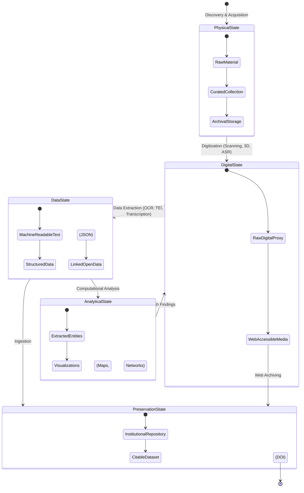
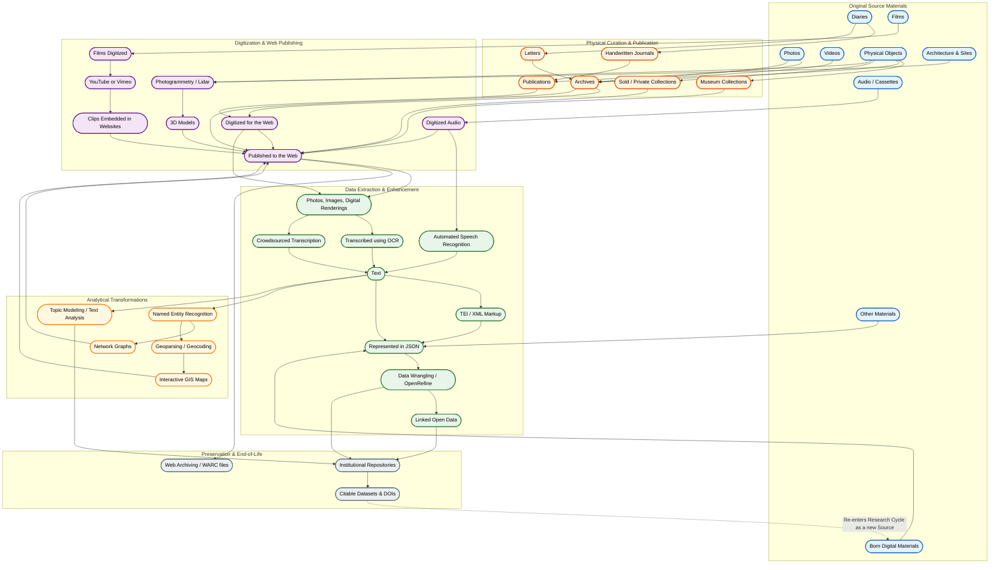
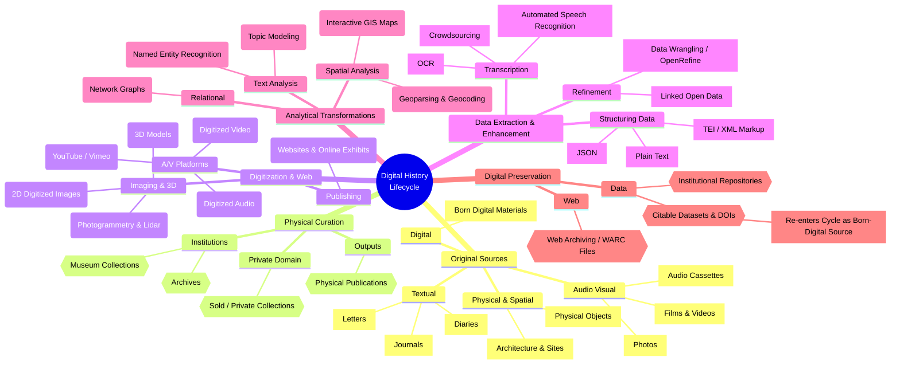

# Other mappings of Digital History

I enjoyed making the 'transformations' diagram on the [schedule](schedule) page so much, I may have gotten carried away trying alternative configurations of the mermaid diagram. Each movement from one box (or branch) of a diagram constitutes a moment where theory and method collide.

## Dighist as a series of 'states'

## Dighist with more kinds of evidence

## Dighist as Mindmap

