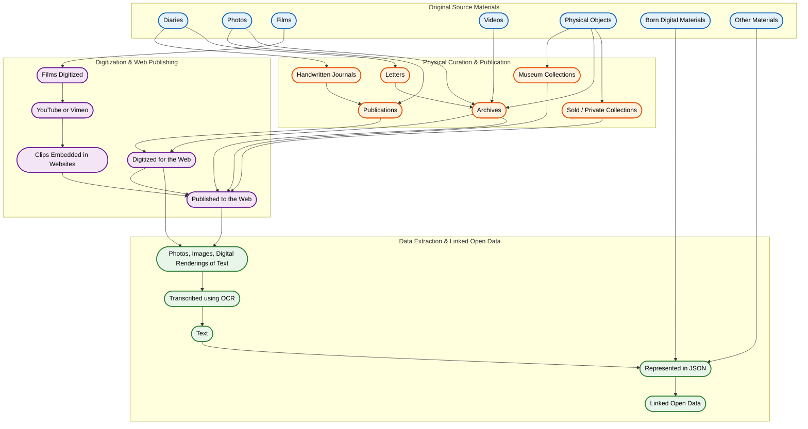

**General pattern**

We meet; we'll take a 15-20 minute break in the middle; we'll build stuff; we'll talk about stuff.

In certain weeks, a designated person will take us through their engagement with a particular tutorial (most will come from the Programming Historian), as indicated below. There will be readings to support this engagement; I will discuss these individually with you once we divy up the work. Some will highlight uses of the approach, or perhaps issues with the approach, or could've usefully been improved by the approach... or... or... or. I will expect you to also clearly articulate connections in other research you've done, read, or courses you're taking/have taken (this alone is an important habit to cultivate.) You can also bring digital history projects in the wild into the discussion.

(**nb** Even if it's not your week to present, it will be a richer experience if you've given the tutorial a shot as well.)

The remaining time will run along the lines of a mini unconference. That is, I expect you to have a sense before class of things you want to work on/discuss/collaborate on. As [thatcamp.org](https://thatcamp.org) says:

> at an unconference, the program isn’t set beforehand: it’s created on the first day with the help of all the participants rather than beforehand by a program committee. Second, at an unconference, there are no presentations — all participants in an unconference are expected to talk and work with fellow participants in every session. An unconference is to a conference what a seminar is to a lecture; going to an unconference is like being a member of an improv troupe whereas going to a conference is (mostly) like being a member of an audience.

I've had far too many seminars that felt like dreadful dreadful conferences. So, let's give this a try. One thing that I think I would like you to discuss every session: how does this particular tutorial move us closer to the final project goal? What could we do with this? How can we open this thing up even more?

These sessions will be opportunities for the more techy to help the less, for the more theoretically inclined to help the more methodologically inclined. I will say this though:

> doing embodies theories of knowing and how you do things reveals what you know. So know what you're doing.

**This schedule will be updated with who-will-lead-or-do-what-when after our first meeting**. The schedule/load can/might be adjusted depending on enrollment.


---

# Base Camp

At base camp, the climbers assemble, the gear is organized, and a route to the top is plotted out. What are the basics that we need? The larger goal of this class _for me_ is to develop your digital history skills so that you can undertake (and expand your imaginary of the possibilities for) digital history projects of your own. If, following Brett, we see Dighist within DH, then dighist is where we use and interrogate the transformations across physical/digital forms to tell history.

**What are the sequence of transformations for the Archaeology Impossible Project?**

Consider the historical evidence of climbing and its various transformations:



What's missing? Every one of those transformations, every one of those blocks, captures a dense theoretical and methodological mass of ideas and practices. Consider your own engagement with dighist and whether or not (or how) you've been thinking about what happens to 'history' during these points of transformation. (The code that generates that view is [here](https://gist.githubusercontent.com/shawngraham/9239b005790ba6cf58a332be98896288/raw/56823afacc667724487b9413c281860018dc0de6/transformations.md) and you can visualize it, experiment by dropping it into [the mermaid live editor](https://mermaid.live)).

## Background Context on Digital History in Canada

At some point before the Fall Break, please read

Gaffield, Chad. ‘Clio and Computers in Canada and Beyond: Contested Past, Promising Present, Uncertain Future’. The Canadian Historical Review, vol. 101, no. 4, 2020, pp. 559–84. [link](https://muse-jhu-edu.proxy.library.carleton.ca/pub/50/article/777491/pdf)

Kim Martin. 'Clio, Rewired: Propositions for the Future of Digital History Pedagogy in Canada' The Canadian Historical Review, vol. 101, no. 4, 2020, pp. 622-639. [link](https://muse-jhu-edu.proxy.library.carleton.ca/pub/50/article/777494/pdf)

## Sept 10. Getting Started

**To install:**

I want you to keep your notes for this class (your thoughts, your observations, your scratch pad as you fight with things) as plain text files. Not word. Not one note. You might have a nice system set up already, but for my pedagogical purposes: plain text files using the .md file extension. _It is harder to kill plain text through neglect_ [see Brett, part 5 of his essay](https://www.adamdjbrett.com/blog/dh-part-5-preserving-digital-humanities-projects/). Some options:
+ [Sublime Text](https://www.sublimetext.com/), 
+ [Notepad++](https://notepad-plus-plus.org/downloads/)
+ [Obsidian](https://obsidian.md/)
+ [Tangent](https://www.tangentnotes.com/)
+ I am also intrigued by [orsn](https://orsn.io/) as it seems to be tailor-made for the kind of work we're doing. 

Bibliographic management:
+ [Zotero](https://zotero.org) for research management (bibliographies, citations, pdf annotations, and note making)
+ [Tropy](https://tropy.org) for research management of photographic materials (whether your own photos or other kinds of imagery)

Code sharing/collaboration:
+ We will set up [github accounts](https://github.com) too. 

**Do not pay for anything**. _Nothing I ask you to do here should involve paying for an account or access. If you find yourself at any point this term being asked for a credit card, **stop** and talk to me._ )

We will spend a bit of time setting up your own personal research management environment and talking about this in general; this isn't so much a part of 'digital history' as 'strategies to keep you sane.'

**To do:**

Once we get set up, let's do -

+ Some of the digital literacy pieces from this [tutorial platform](https://test-for-dh-tutorials.netlify.app/dashboard). Nb, this is something I pulled together; the 'time estimates' it makes are in no way realistic and over state the amount of time a tutorial will take (currently just uses default values).

+ Perhaps some command line shennanigans: [Terminus](https://web.mit.edu/mprat/Public/web/Terminus/Web/main.html); [Command Line Murders](https://github.com/veltman/clmystery).

+ Simpkin, Sarah. ‘Getting Started with Markdown’. Programming Historian, Nov. 2015. programminghistorian.org, [link](https://programminghistorian.org/en/lessons/getting-started-with-markdown).

+ Tenen, Dennis, and Grant Wythoff. ‘Sustainable Authorship in Plain Text Using Pandoc and Markdown’. Programming Historian, Mar. 2014. programminghistorian.org, [link](https://programminghistorian.org/en/lessons/sustainable-authorship-in-plain-text-using-pandoc-and-markdown).

**To mull:**

+ Baker, James. ‘Preserving Your Research Data’. Programming Historian, Apr. 2014. programminghistorian.org, [link](https://programminghistorian.org/en/lessons/preserving-your-research-data.)

+ Heppler, Jason A. ‘How I Use Obsidian’. Jason Heppler Weblog, July 2024. jasonheppler.org, [link](https://jasonheppler.org/2024/07/15/how-i-use-obsidian/).

+ Heppler, Jason A. ‘How I Use Obsidian Redux’. Jason Heppler Weblog, January 2026 [link](https://jasonheppler.org/2026/01/08/how-i-use-obsidian-redux/)


## Sept 17: Digital History in the Wild

We'll consider some examples of what digital history looks like, and the kinds of questions it might ask (or permit the asking). We'll look ahead on the syllabus and divvy up the various tutorials. 

**Before coming to class read:**

+ Catherine D’Ignazio and Lauren F. Klein, “What Gets Counted Counts” and “The Numbers Don’t Speak for Themselves,” Data Feminism (2020), [https://data-feminism.mitpress.mit.edu/](https://data-feminism.mitpress.mit.edu/).
+ [FAIR](https://www.go-fair.org/fair-principles/), [CARE](https://www.gida-global.org/careprinciples)
+ Gupta, Neha, Andrew Martindale, Kisha Supernant, and Michael Elvidge. “The CARE Principles and the Reuse, Sharing, and Curation of Indigenous Data in Canadian Archaeology.” Advances in Archaeological Practice 11, no. 1 (2023): 76–89. [link](https://doi-org.proxy.library.carleton.ca/10.1017/aap.2022.33).

**To do**

Then, select two pieces from [_Current Research in Digital History_](https://crdh.rrchnm.org/). Read the piece. See if you can find the underlying data. Does the project make the data available? Is there a public facing website for the larger project? Is there an intersection with Public History? What about FAIR, CARE? What data 'counts', to whom, and why? Be prepared to talk about how the underlying data for these projects are presented, discussed, curated, and explored. List any tools/techniques that are new to you. What can you find out about _how_ to use such a tool? (part of the challenge of _doing_ digital history lies in what might be called 'Dependency Hell' - to use this, you need _that_; to do _that_ you need _this other thing_... and so on). 

**What comes next**

Take a look at your assigned Programming Historian tutorial. Pay attention to the requirements, and try to work out what assumptions the tutorial's author has made about your previous experience and what you need to know to be successful with the tutorial. What are the known unknowns (as it were) for the method?


## Sept 24: No Class

_I am away this day for a conference. I invite you all to get together in a coffee shop, and explore the Reviews in DH and other resources to see if there are examples of the kind of work you'd like to be doing. Then, as a group, feel free to compose an email to me saying, 'how did they do x,y,z, and can we learn that?' I'm happy to throw things out and rejig so that we let your interests surface._

---

# Camp One

As we progress up the mountain, things start to get *real*.

## October 1. A few more things

Let's consolidate a few things first:
- Let's go over command line again:[Command Line Murders](https://github.com/veltman/clmystery)
- Let's explore some of the digital literacy module [here](https://test-for-dh-tutorials.netlify.app/lesson/digital-literacy-01)
- Let's set up a research folder using MacOdrum's fancy tool [generator](https://alpozturkcarleton.github.io/AlpTools/folder-structure-generatorv4.html)

Now: Do you need to know how to 'code'? What does that even mean, 'to code'? Consider the example projects you've already looked at: where is the 'coding' there?

Let's look at this [collection of letters](https://www.gutenberg.org/cache/epub/2087/pg2087.txt). You're working on a project for a historian of the environment, and the main research question is how 19th century scientists envisioned the interaction of humans in an ecological context. What kinds of questions might you ask, and what kinds of analyses have you seen already that could be useful here? Of these, how have they organized their data? Look at the collection of letters. If you were doing all of this by hand, how would you approach the material so that you were systematic? 

Here's a command that we could use to split by a pattern (Mac): ```csplit -f darwin -n 3 pg2087.txt '/CHARLES DARWIN TO/' '{212}'``` [csplit](https://ss64.com/mac/csplit.html).

Here's a windows powershell approach to do the same thing:

```bash
$i=0; (Get-Content pg2087.txt -Raw) -split '(?m)(?=^CHARLES DARWIN TO)' | ForEach-Object { Set-Content "darwin$("{0:D3}.txt" -f $i++)" $_ }
```

(this bit `split '(?m)(?=^PATTERN)'` means look for multiple lines, and make the split at the start of the pattern).

Now, having done that, let's drop the result into Voyant Tools. _AND_, for extra fun, let's install Voyant on our own machines (and why would we want to do that?) [installation instructions](https://github.com/voyanttools/VoyantServer/wiki/VoyantServer-Tutorial) ; [a voyant mirror courtesy of LINCS if local installation goes wrong](https://voyant.lincsproject.ca/). 

Play. Try out different tools. Explore your corpus. Notice that your split files reflect the chronological sequence used by the original compiler of the letters! That's a handy bonus, since we can see change-over-time. _How do you get your results out of Voyant?_

**Things we used this session** - file and folder creation. Simple commands to reshape 'data'. Exploratory visualization to shape questions (and which might suggest we need to reshape the data...). _Is this coding_? 

**By the way** Coding for Humanists @ MacOdrum: Wednesdays, October 28 to Wednesday, December 16 from 1:30 p.m. to 4:30 p.m


## October 8. Digitizing 

We'll use some of the equipment from the [XLab](https://carleton.ca/xlab) to digitize both physical and documentary objects.

**Before coming to class read:**

+ Ryan Cordell, 2017. ‘Q i-jtb the Raven’: Taking Dirty OCR Seriously' [_Book History_ 20: 188-225](https://ocul-crl.primo.exlibrisgroup.com/permalink/01OCUL_CRL/1ortgfo/cdi_proquest_journals_2008107951) (see also [link](https://ryancordell.org/research/qijtb-the-raven/))
+ Sparrow, T., Bain, K., Kimber, M. and Wilson, A.S. 2024 Visualising Heritage: using 3D immersive technologies to innovate, document and communicate rich narratives for HS2, Internet Archaeology 65. [link](https://doi.org/10.11141/ia.65.7)
+ Scheinfeldt, T. 2025. ‘Handwriting Recognition Roundup’. Found History, 6 Dec. 2025 [link](https://foundhistory.org/handwriting-recognition-roundup/)

**To do**

Bring a small object that you might like to document in 3d, or some documents you'd like to scan. For 3d work, we might start with [this piece of equipment](https://carleton.ca/xlab/2026/equipment-how-to-the-three-matter-and-form-scanner/). We might try LIDAR scanning the classroom or perhaps the Quad, we'll see.

We'll also try Crump, Jon. ‘Generating an Ordered Data Set from an OCR Text File’. Programming Historian, Nov. 2014. programminghistorian.org, [link](https://programminghistorian.org/en/lessons/generating-an-ordered-data-set-from-an-OCR-text-file) 

If you have a google gmail account, we can try dropping an image into an LLM and asking for structured data in return. 

**Side Quest:**
Speaking of images, sometimes the most useful thing we can do is systematically keep track of both the images AND our annotations. That's what Tropy's for. And once we've gotten a collection of annotated images, _sharing_ those notes, images, and annotations might be the most [_generous_](https://generousthinking.hcommons.org/) thing we could do.

Put your research photos online using a static website via Tropy [(instructions here)](https://electricarchaeology.ca/2024/07/25/make-your-tropy-collection-and-annotations-available-with-canopy/)

## October 15: Data Metadata, Paradata

Ask yourself: has your research to date been _sustainable_ or _reproducible_ or _replicable_? What do these terms mean, for us? Why should historians care about this sort of thing?

There are two kinds of 'research data' that we could make available. There are our primary materials (and all of their related annotations and mark-up). There are our thoughts on the secondary materials we read to contextualize those primary materials. There are the data - the things we study themselves. There are the metadata - the information that contextualizes the sourcing of that data. And there are the paradata - the information that details the transformations we have done to the metadata and data _and why_.

**To Read**

+ It's over 10 years old now, but Caleb McDaniel's [Open Notebook History](http://wcaleb.org/blog/open-notebook-history) still is posing questions that historians largely avoid. Have a read of what [several archaeologists argue about 'open science' in archaeology](https://faculty.washington.edu/bmarwick/PDFs/Marwick_et_al_2017_SAA_Record_Sept.pdf). Where are the points of intersection between McDaniel and the archaeologists? What parts of this spark joy? What bits fire up anxiety? What does this mean for you and your research? (On a somewhat related note, [see this collection of previous CU History graduate degree work; what opportunities are lost here, gained here?](https://cuhistory.github.io/grads/))

**To do**

+ Handy bit of code: Here's a Google Notebook I made that uses something called 'paddleOCR' to identify text in an image and then OCR it [link](https://colab.research.google.com/drive/1TYhLsOYW4nVfX5NP8Fi-O1QU0_ndj_ik). There are many other options for OCR'ing text. Use this on some of the document scans from last week. Document the result also in terms of its data, metadata, and paradata.
+ See [what doing open notebook history through creating a 'datapage' could look like here](https://datapages.github.io/datapage/) and here's the template for [making such a page ourselves](https://github.com/datapages/datapage). Other options exist (including things like [datasette.io](https://datasette.io)). Find a historical dataset and create a datapage for it.
+ Cosovschi, Agustín. ‘From Sources to Data: Designing a Database for the Humanities and Social Sciences with Nodegoat’. Programming Historian, Feb. 2024. programminghistorian.org, [link](https://programminghistorian.org/en/lessons/designing-database-nodegoat).

## October 22: Discoverability and theorizing Search

Sometimes, historical information that we might want to study is provided via an 'application programming interface' or API. Sometimes, it's in a webpage that you need to parse in order to get it into a useful format. 

{: .note } 
Because of adversarial bad-actor scraping of websites by AI companies, many websites, institutions, and individuals have had to put counter measures into place to stop scraping. The materials here might therefore have to be changed to take this into account.

Nb, 'scraping' isn't necessarily a bad thing; a browser works by loading data _onto your own computer_ and scraping is a way to automate retrieval of elements on a webpage. But if it isn't done **politely** (ie, at human-scale rather than machine-scale) it carries serious costs. See for instance Eric Kansa's [recent essay in Internet Archaeology](https://intarch.ac.uk/journal/issue71/15/).

**To read**

+ Sugimoto, Go. ‘Introduction to Populating a Website with API Data’. Programming Historian, May 2019. programminghistorian.org, [link](https://programminghistorian.org/en/lessons/introduction-to-populating-a-website-with-api-data).

+ Underwood, Ted. ‘Theorizing Research Practices We Forgot to Theorize Twenty Years Ago’. Representations, vol. 127, no. 1, Aug. 2014, pp. 64–72. [link](https://www-jstor-org.proxy.library.carleton.ca/stable/10.1525/rep.2014.127.1.64)

**To do**

Let's take a look at [canadiana.ca](https://www.canadiana.ca/search/). Enter a query, and then notice the url and how it is constructed. Modify your query using the form, and see how things change after the `?` in the url.

Then give this a try:

[link to colab notebook](https://colab.research.google.com/drive/1gS02yA0epRZPe81JeDiEsbkkRC6yW-KH?usp=sharing)

+ Williamson, Evan Peter. ‘Fetching and Parsing Data from the Web with OpenRefine’. Programming Historian, Aug. 2017. programminghistorian.org, [link](https://programminghistorian.org/en/lessons/fetch-and-parse-data-with-openrefine).

When we're dealing with data organized in a structured tree, one can parse the structure of the website, and use the Wget command to give it a go. See

+ Milligan, Ian. ‘Automated Downloading with Wget’. Programming Historian, June 2012. programminghistorian.org, [link](https://programminghistorian.org/en/lessons/automated-downloading-with-wget).

and

+ Kurschinski, Kellen. ‘Applied Archival Downloading with Wget’. Programming Historian, Sept. 2013. programminghistorian.org, [link](https://programminghistorian.org/en/lessons/applied-archival-downloading-with-wget).

{: .warning }  
Badly-formed wget commands (or commands not correctly shut down) can lead to downloading **an awful lot of data** and can make you look like a bad-actor, which we do not want. AI companies have largely posioned the well for these methods as something we might use.


---

**Fall reading week Oct 26 - Oct 30**

I'm leaving this here as something you should read _at some point_. Nockels, J., et al. 2024. The implications of handwritten text recognition for accessing the past at scale, OCR & Handwritten text. Journal of Documentation 80.7, 148-167 [link](https://www.emerald.com/insight/content/doi/10.1108/JD-09-2023-0183/full/pdf).

---

# Camp 2

At this point in the climb, we're fully invested in the process. We might have to go back down to Camp 1 if we find we've gone the wrong way. We might be preparing for the next leg.

## Nov 7: Networks

I was a relatively early proponents of network analysis in archaeology. We'll talk about what a network perspective might offer (hey, it made my entire PhD!), as well as perils and pitfalls. (Here's a past [mre using a network approach on Ontario history](https://figshare.com/articles/journal_contribution/Networks_of_Commemoration_Gender_Class_and_the_Remembrance_of_General_Brock_1898_1912/710956?file=1073570))

**To Read**

+ Ahnert, Ruth, Sebastian E. Ahnert, Catherine Nicole Coleman, and Scott B. Weingart. 2020. The Network Turn: Changing Perspectives in the Humanities. Cambridge: Cambridge University Press. [link](https://doi.org/10.1017/9781108866804). (Our library, [direct link](https://www-cambridge-org.proxy.library.carleton.ca/core/services/aop-cambridge-core/content/view/CC38F2EA9F51A6D1AFCB7E005218BBE5/9781108791908AR.pdf/the-network-turn.pdf)). This is a short work, read the **intro** and **part 1**, dip into anything else that strikes your fancy.

+ For examples of network analysis in the wild, [this issue of the Journal of Historical Network Research](https://jhnr.uni.lu/index.php/jhnr/issue/view/8) is great - see in particular [Ruffini's conclusion](https://jhnr.uni.lu/index.php/jhnr/article/view/82/44) to the issue, which addresses the 'so what' and the 'we knew this already' and 'what if we're wrong'. **This is important**. On a similar note, see Lincoln 2015 on 'confabulation in the humanities' [here](https://matthewlincoln.net/2015/03/21/confabulation-in-the-humanities.html).

**To do**

A handy tool for quick network visualizations: [https://networknavigator.jrladd.com/](https://networknavigator.jrladd.com/). Here is a [dataset](http://www.themacroscope.org/1.0/datafiles/source-texas-correspondence.txt) of the index of correspondence for the Republic of Texas; knowing nothing else about the Republic of Texas, how might visualizing this correspondence network provoke new insights or questions?

+ Düring, Marten. ‘From Hermeneutics to Data to Networks: Data Extraction and Network Visualization of Historical Sources’. Programming Historian, Feb. 2015. programminghistorian.org, [link](https://programminghistorian.org/en/lessons/creating-network-diagrams-from-historical-sources).

+ Ladd, John R., et al. ‘Exploring and Analyzing Network Data with Python’. Programming Historian, Aug. 2017. programminghistorian.org, [link](https://programminghistorian.org/en/lessons/exploring-and-analyzing-network-data-with-python).

+ Brey, Alex. ‘Temporal Network Analysis with R’. Programming Historian, Nov. 2018. programminghistorian.org, [link](https://programminghistorian.org/en/lessons/temporal-network-analysis-with-r). (You can install RStudio on your machine to run R, or you can change the runtime for Google Colab from Python to R like [so](https://archive.ph/Eqe57).)

## Nov 12: Topic Models and Text Analysis

<iframe width="560" height="315" src="https://www.youtube.com/embed/gN2x_KjJI1o?si=IegSYv86dwFWzXsn" title="YouTube video player" frameborder="0" allow="accelerometer; autoplay; clipboard-write; encrypted-media; gyroscope; picture-in-picture; web-share" referrerpolicy="strict-origin-when-cross-origin" allowfullscreen></iframe>

Now that we've got a whole bunch of text, what might we do? I love the Data Sitters Club - they're a group of scholars using a wide variety of DH approaches to understand an important book series from the '80s & '90s. Read about [their misadventures with topic modeling here](https://datasittersclub.github.io/site/dsc20.html). Let's also play with [Voyant](https://voyant-tools.org). 

**To do**

+ Mähr, Moritz. ‘Working with Batches of PDF Files’. Programming Historian, Jan. 2020. programminghistorian.org, [link](https://programminghistorian.org/en/lessons/working-with-batches-of-pdf-files). After OCR'ing pdfs, it does some topic modeling.

+ If your documents are kep as text files, give [this a try instead](https://senderle.github.io/topic-modeling-tool/documentation/2017/01/06/quickstart.html). The topic modeling tool uses MALLET under the hood (and you can learn more about how _that_ works and why, [here](https://programminghistorian.org/en/lessons/topic-modeling-and-mallet).) Here's [a zip file with the text of historical plaques from Toronto that you can try fitting a topic model to](http://www.themacroscope.org/1.0/datafiles/toronto-plaques.zip). What patterns in 'public memory' do you find?

---

# Camp 3

Now we're still cycling backwards and forwards, trying to find the route to the summit, but the way is more or less clear.

## Nov 19: examining images at scale

What can we see if look at vast amounts of historical imagery at once? I've just completed a project looking at social media and the trade in human remains (people buy and sell human remains online). A major tool we used were various neural network models trained to discriminate different classes of materials (including retraining such models for our own purposes). This week, I'll talk about that for a bit, and we'll think about under what conditions such approaches would be useful in your own research, and what dangers may lurk.

**To Read**

+ Chapter 1 in Arnold & Tilton's book - [OA version](https://direct.mit.edu/books/oa-monograph/5674/chapter/4361339/Distant-Viewing-Theory)

+ Wevers, M. J. H. F., Vriend, N., & De Bruin, A. (2022). What to do with 2.000.000 Historical Press Photos? The Challenges and Opportunities of Applying a Scene Detection Algorithm to a Digitised Press Photo Collection. TMG – Journal for Media History, 25(1) [link](https://doi.org/10.18146/tmg.815). 

+ Melvin Wevers, Thomas Smits, The visual digital turn: Using neural networks to study historical images, Digital Scholarship in the Humanities, Volume 35, Issue 1, April 2020, Pages 194–207, [link](https://doi.org/10.1093/llc/fqy085 https://academic.oup.com/dsh/article-pdf/35/1/194/32976784/fqy085.pdf).

**To do**

+ Play with [Teachable Machines](https://teachablemachine.withgoogle.com/)
+ Strien, Daniel van, et al. ‘Computer Vision for the Humanities: An Introduction to Deep Learning for Image Classification (Part 1)’. Programming Historian, Aug. 2022. programminghistorian.org, [link](https://programminghistorian.org/en/lessons/computer-vision-deep-learning-pt1).
+ Strien, Daniel van, et al. ‘Computer Vision for the Humanities: An Introduction to Deep Learning for Image Classification (Part 2)’. Programming Historian, Aug. 2022. programminghistorian.org, [link](https://programminghistorian.org/en/lessons/computer-vision-deep-learning-pt2).

## Nov 26: Knowledge Graphs, vectors, embeddings

Language models work by expressing patterns in the training corpus as vectors in a multi-dimensional space. Why language models seem so able to do so many things is largely a function of size and speed. In the readings below I give you two pieces from over a decade ago by Ben Schmidt (a digital humanities scholar who now is at a company called Nomic) that introduced to many dh people the idea of vectors and embeddings and the things they could do. I used his code on materials from the human remains trade to understand how sellers 'constructed' the idea of human remains as being something you could sell. Anyway, the technology has progressed and there are uses here for historians in mapping our materials within the huge multidimensional space the corpus as a whole describes.

**To Read**

+ Schmidt, Ben. 2015. [Word Embeddings](https://benschmidt.org/posts/2015-10-25-Word-Embeddings/) and [Word Embeddings: Rejecting the Gender Binary](https://benschmidt.org/posts/2015-10-30-rejecting-the-gender-binary/).
+ Graham, S., Yates, D., El-Roby, A., Brousseau, C., Ellens, J. and McDermott, C. (2023) ‘Relationship prediction in a knowledge graph embedding model of the illicit antiquities trade’, Advances in Archaeological Practice, 11(2), pp. 126–138. [link](https://traffickingculture.org/uploads/2023/06/Graham-et-al.pdf)
+ Graham, Shawn. Once Upon A Time: The Behaviour Space(s) of Stories. [link](https://electricarchaeology.ca/2026/06/03/once-upon-a-time-the-behaviour-spaces-of-stories/)

**To Explore**

Eric Kansa's [visualization of the the archaeological materials from Poggio Civitate, where the descriptions are expressed in a vector space and then visualized using a forced graph algorithm](https://www.linkedin.com/posts/eric-kansa-a5b8784_archaeology-datavis-etruscan-activity-7490516475309621248-7wDO) ([direct link to viz](https://storage.googleapis.com/opencontext-media/poggio-civitate/data-vis/pc-catalog-objs-embeddings-vessel-multi.html); takes a bit of time to load).

**To do**

+ Build a knowledge graph embedding model: [colab notebook](https://colab.research.google.com/drive/1nhPWgDjaoBwZkV8V_4q8Q8P2Nt13cNx6?usp=sharing) (save a copy to your own gdrive and then work from that, remember.)
+ Build a custom image search model (go to google colab, open a notebook from github, and paste in this url) [https://github.com/shawngraham/pn_notebooks/blob/main/2_experiment_2_Use_ArchaeoCLIP_in_a_notebook.ipynb](https://github.com/shawngraham/pn_notebooks/blob/main/2_experiment_2_Use_ArchaeoCLIP_in_a_notebook.ipynb)


---

# The Summit!

At the summit, we have achived the main goals, but there's still some work to do. For one thing, you've got to let people know that you've made it and why it matters...

## Dec 3:

Being able to control your own space online enables a certain kind of freedom. Take a look at some academics' scholarly websites- [Kathleen Fitzpatrick](https://kfitz.info/); [Jason Heppler](https://jasonheppler.org/); [Chantal Brousseau](https://chantalbrousseau.xyz/); [Tim Sherratt](https://timsherratt.au/); [Jim Clifford](https://jimclifford.ca/); [Kim Martin](https://www.kim-martin.ca/). What unifies them? How are they different? What audience(s) do they serve? What constitutes effective presence?

**To read**

Please read the following tutorials about building static websites, especially the _why_ of it all. I'm not a fan of Jekyll - I find it frustrating to use - but I want you to know these things. Don't worry about trying to put together a Jekyll powered site using these tutorials (unless you really want to).

+ Visconti, Amanda. ‘Building a Static Website with Jekyll and GitHub Pages’. Programming Historian, Apr. 2016. programminghistorian.org, [link](https://programminghistorian.org/en/lessons/building-static-sites-with-jekyll-github-pages).
+ Visconti, Amanda, et al. ‘Running a Collaborative Research Website and Blog with Jekyll and GitHub’. Programming Historian, Nov. 2020. programminghistorian.org, [link](https://programminghistorian.org/en/lessons/collaborative-blog-with-jekyll-github).
+ Marwick, Ben, et al. ‘Packaging Data Analytical Work Reproducibly Using R (and Friends)’. The American Statistician, vol. 72, no. 1, Jan. 2018, pp. 80–88. [link](https://doi.org/10.1080/00031305.2017.1375986). What bits are applicable to us?

**To do**

We'll build a website using [Pelican](https://getpelican.com/#quickstart), which is a python package that will read a folder of text files (in the markdown format), pass them through a template, and spit out the necessary html files that make a website. We'll then put these files online using Github Pages. (See my notes [here](./extras/pelicans.html)). 

Or we can try [cb-essay](https://collectionbuilder.github.io/cb-essay/) which builds a story-driven site from a google sheet filled with metadata.

You're also welcome to give my work-in-progress ['Polybius'](https://shawngraham.github.io/polybius/) a try; like cb-essay, it's meant to be a generator for a data-driven story telling website. Critiques welcome. See also my rendering of the the Historic Places dataset [here](https://shawngraham.github.io/historicplaces/).

And there's a whole lot more that could be done; check out [Epoiesen](https://epoiesen.carleton.ca).

## Dec 11: Sunsetting a digital project

**To read**

+ Arts & Humanities Research Computing. Sunsetting [link](https://digitalhumanities.fas.harvard.edu/resources/sunsetting/). 
+ Holmes, Martin, and Joey Takeda. ‘From Tamagotchis to Pet Rocks: On Learning to Love Simplicity through the Endings Principles’. Digital Humanities Quarterly, vol. 017, no. 1, May 2023.
+ Endings Project, Principles: [link](https://endings.uvic.ca/principles.html)

**To mull**
Perhaps digital projects _should_ be allowed to die? And: just because something is digital in nature, does that automatically mean that it has to be accessible _to_ the web? Especially in this age where culture is being taken to pieces, and monetized through llms?

**To do**

Let's talk about your own research/experiment. What were the data? What were the transformations? What emerged from this engagement? How you can bring your digital work to a close when doing your thesis or MRE.  

## Into the future?

Have a look at ["The Historian's Desktop"](https://generativelives.substack.com/p/the-historians-desktop) or ["Autarch"](https://arcane-lab.org/autarch/). Taking those as indicative models of future engagement with computational approaches to the past, which of those would you prefer, as a scholar? Consider [Doctorow on Reverse Centaurs](https://pluralistic.net/2025/12/05/pop-that-bubble/). 

Things are changing fast. If a single prompt can accomplish (seemingly) so much, why have I spent so much time trying to teach you the 'hard' way? The last thing I want you to do - and this isn't graded, and it's not for me to pass judgement on as an instructor - is for you to write down your own manifesto for dealing with AI, the digital, going forward.  

Set out your own guidelines. Revise them, revisit them, as you go forward. Whatever you do next: be intentional. Be informed. Be clear about what you will do, and what you will _not_.